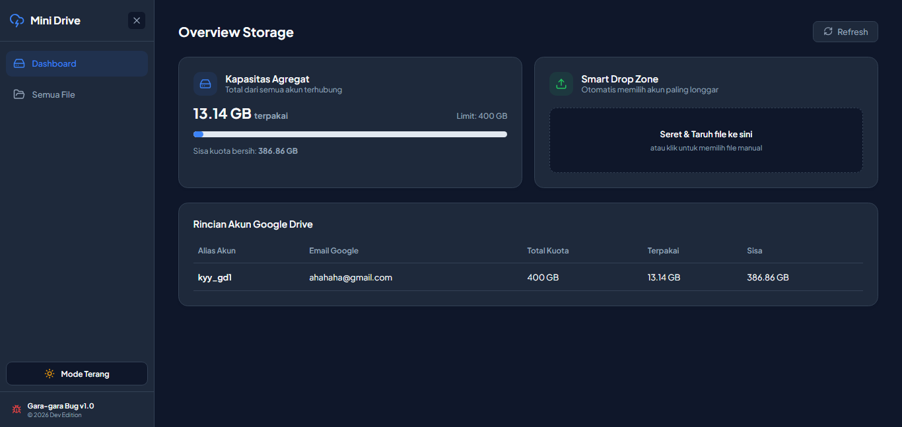
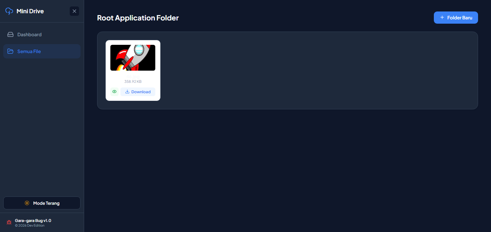

# 📊 Mini Cloud Storage Aggregator

[](https://fastapi.tiangolo.com/)
[](https://react.dev/)
[](https://www.mysql.com/)
[](https://vitejs.dev/)

> **Mini Cloud Storage Aggregator** adalah platform manajemen cloud storage modern yang menggabungkan kapasitas dari banyak akun Google Drive ke dalam satu dashboard terpadu.

Pengguna dapat memanfaatkan kapasitas penyimpanan gabungan dari beberapa akun Google Drive tanpa perlu mengetahui lokasi fisik file sebenarnya. Sistem akan mengelola distribusi file secara otomatis dan menampilkan seluruh penyimpanan seolah-olah berada dalam satu ruang cloud yang besar.

---

## ✨ Fitur Utama

### 📈 Combined Storage Dashboard

Pantau seluruh kapasitas penyimpanan secara real-time:

* Total kapasitas gabungan seluruh akun
* Total ruang terpakai
* Sisa kapasitas tersedia
* Statistik penggunaan per akun Google Drive

### 🧠 Smart Upload Distribution

Sistem unggah file cerdas yang secara otomatis:

* Menganalisis kapasitas setiap akun
* Memilih akun dengan ruang kosong terbesar
* Menyimpan file ke akun yang paling optimal
* Menyeimbangkan distribusi penyimpanan

### 📁 Unified File Explorer

Kelola seluruh file dari berbagai akun Google Drive melalui satu antarmuka:

* Nested folders
* Pembuatan folder baru
* Upload file
* Download file
* Hapus file dan folder
* Navigasi direktori interaktif

### 👁️ Live Image Preview

Fitur preview gambar tanpa perlu mengunduh file:

* Thumbnail otomatis
* Preview modal
* Dukungan berbagai format gambar populer

### 🌙 Light & Dark Mode

Tampilan modern dengan dukungan:

* Light Mode
* Dark Mode
* Penyimpanan preferensi tema pengguna

### 🔐 Multi Google Drive Account Management

Kelola banyak akun Google Drive dalam satu dashboard:

* OAuth2 Authentication
* Refresh Token Management
* Sinkronisasi akun
* Monitoring kapasitas per akun

---

## 🏗️ Arsitektur Sistem

```plaintext
mini-gdrive-backend/
├── config/
│   └── database.py
│
├── credentials/
│   └── credentials.json
│
├── routers/
│   ├── auth.py
│   ├── files.py
│   ├── folders.py
│   └── accounts.py
│
├── main.py
├── requirements.txt
│
└── mini-gdrive-frontend/
    ├── src/
    │   ├── components/
    │   ├── pages/
    │   ├── services/
    │   ├── App.jsx
    │   └── index.css
    │
    ├── package.json
    └── vite.config.js
```

---

## 🚀 Instalasi Lokal

### 1. Prasyarat

Pastikan sistem telah terpasang:

* Python 3.10+
* Node.js LTS
* MySQL (Laragon / XAMPP)
* Google Cloud Project
* Google Drive API Enabled

---

## 🔑 Konfigurasi Google Drive API

### Membuat OAuth Credentials

1. Buka Google Cloud Console
2. Buat Project baru
3. Aktifkan Google Drive API
4. Konfigurasi OAuth Consent Screen
5. Tambahkan akun sebagai Test User
6. Buat OAuth Client ID

Pilih:

```text
Application Type:
Web Application
```

Authorized Redirect URI:

```text
http://localhost:2387/auth/callback
```

Download file JSON dan simpan sebagai:

```plaintext
credentials/credentials.json
```

---

## ⚙️ Konfigurasi Database

Buat database MySQL:

```sql
CREATE DATABASE mini_gdrive;
```

Sesuaikan konfigurasi koneksi database pada:

```plaintext
config/database.py
```

Contoh:

```python
DB_HOST = "localhost"
DB_USER = "root"
DB_PASSWORD = ""
DB_NAME = "mini_gdrive"
```

---

## 🖥️ Menjalankan Backend

Masuk ke folder backend:

```bash
cd mini-gdrive-backend
```

Install dependencies:

```bash
pip install -r requirements.txt
```

Jalankan FastAPI:

```bash
uvicorn main:app --host 0.0.0.0 --port 2387 --reload
```

API Documentation:

```text
http://localhost:2387/docs
```

---

## 🌐 Menjalankan Frontend

Masuk ke folder frontend:

```bash
cd mini-gdrive-frontend
```

Install dependencies:

```bash
npm install
```

Jalankan Vite:

```bash
npm run dev
```

Frontend tersedia pada:

```text
http://localhost:5173
```

---

## 🛠️ Tech Stack

### Backend

* FastAPI
* Python 3
* Google API Client
* OAuth2
* Uvicorn

### Frontend

* React 18
* Vite
* Axios
* React Router
* Lucide Icons

### Database

* MySQL

### Cloud Integration

* Google Drive API
* Google OAuth2

---

## 📷 Screenshot

### Dashboard



### File Explorer



---

## 🔒 Keamanan

File berikut tidak boleh diunggah ke GitHub:

```gitignore
credentials/
token.json
.env
__pycache__/
node_modules/
```

Pastikan file `credentials.json` dan refresh token tidak pernah dipublikasikan.

---

## 📄 Lisensi

Project ini dibuat untuk tujuan pembelajaran, eksperimen, dan pengembangan portofolio.

---

## 👨‍💻 Author

**Khiky Ferdhian Prathama**

Mini Cloud Storage Aggregator — Unified Multi-Google Drive Storage Platform.
